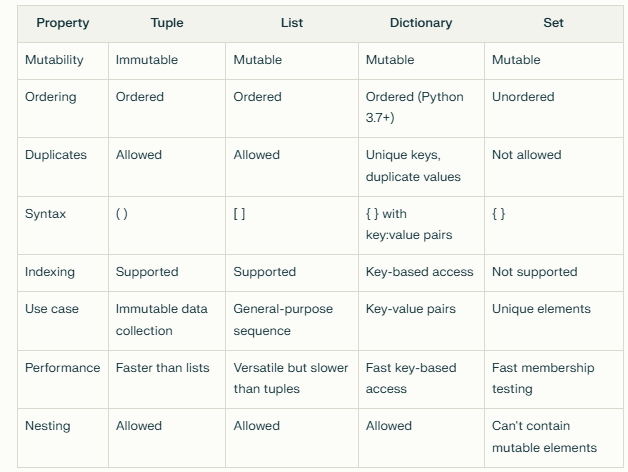

```
http://localhost:8888/tree

```

### Jupyter Notebook Instalaion
 ```
 https://stackoverflow.com/questions/62255762/jupyter-is-not-recognized-as-an-internal-or-external-command-operable-program  

 https://replit.com/@JudeOkagu1/CodeInBlack#index.js

 https://onecompiler.com/python2/3ysyk2cfv


 $ py -m notebook
Otherwise

$ python -m pip install jupyter --user
$ jupyter notebook

 ```

 ### Global Variables

 ```
 x = "awesome"

def myfunc():
  global y
  y = "yellow"
  print("Python is " + x,y)

myfunc()
print("Python2 is " + x,y)


def myfunc2():
  # global y
  y = "yellow"
  print("JS is " + x,y)

myfunc2()
print("JS2 is " + x,y)


```

### DATA TYPES

```

x = ["apple", "banana", "cherry"]   -- list

x = ("apple", "banana", "cherry")  --tuple

x = range(6)                  --range

x = {"name" : "John", "age" : 36} --dict

x = {"apple", "banana", "cherry"}  set

x = frozenset({"apple", "banana", "cherry"})   frozenset

x = bytearray(5)      bytearray

```

 ### LIST SETS TUPLES AND DICTIONARIES

 

 ```
 List is a collection which is ordered and changeable. Allows duplicate members.
Tuple is a collection which is ordered and unchangeable. Allows duplicate members.
Set is a collection which is unordered, unchangeable*, and unindexed. No duplicate members.
Dictionary is a collection which is ordered** and changeable. No duplicate members.
```


### LIST 
#### list are also inbult functions check below MUTABLE
#### LIST are Mutable, LIST allow Index, LIST Can be updated by the Index, LIST allow duplicate Values
 ```
mylist = ['juud','cole']
mylist2 = [3,4,5]
mylist3 = [4,3,5]


mylist3 == mylist3 //False because they need to be on order

print(mylist2.append(20))  // [3,4,5,20]


mylist4 = [4,3,5,5,5,5]
print(len(mylist4)) // 6  counts all values


list = [1,2,3,4,5,6,7,8,9,10]
print(list[1::2]) returns  [2, 4, 6, 8, 10]
print(list[0:2])  returns [1, 2]
print(list[5])    returns 6
 ```
 #### List Methods

 ```

fruits = ['apple', 'banana', 'cherry']
cars = ["benz","bmw","audi","honda"]
num = [1,2,3]

fruits.append(cars)

# print(fruits) ## adds an array to the end and makes it an array
# fruits.extend(cars) 
# print(fruits)    ## adds an array to the end and extrends the present array or y = cars + fruits 

count = fruits.count('cherry') ## prints unique orrorance
print(count)

#### append adds the whole list as an extra variable; while extend, adds the individual content of the list as individual variables

fruits = ['apple', 'banana', 'cherry']
cities = ['houston', 'dallas', 'austin']
cars = ["benz","bmw","audi","honda"]
num = [1,2,3]

fruits.append(cars)
cities.extend(cars) 
print(fruits)  ['apple', 'banana', 'cherry', ['benz', 'bmw', 'audi', 'honda']]
print(cities)  ['houston', 'dallas', 'austin', 'benz', 'bmw', 'audi', 'honda']

# print(len(cities))  returns 7
# print(len(fruits))   returns 4


index = fruits.index('cherry') ## prints unique orrorance
print(index)  ## prints the index of the element

fruits.insert(1,'orange') ## inserts the element at the given index
print(fruits)
fruits.pop(1) ## removes the element at the given index
print("removes pop",fruits)
fruits.remove('apple') ## removes the element at the given index
print("removes apple",fruits)
fruits.sort()    
print("sort in alphanetical order",fruits)
fruits.reverse()
mylist.sort(reverse = True)  sorts in reverse order
print("reverses a list",fruits)


 ```

 #### Loops in List

 ```
 
newlist = [x for x in ['apple', 'banana', 'cherry']]
print(newlist[2])    returns a list


for x in ['apple', 'banana', 'cherry']:
  print(x)   returns a different individual values

```
#### List Comprehensions

```
fruits = ["apple", "banana", "cherray", "kiwai", "mango"]
newlist = [x for x in fruits if "apple" in x]

print(newlist)

```


### SETS  
#### sets are also inbuit functions like list() check below
#### SETS are  not mutable, SETS dont allow Index, SETS can not be updated by the Index, SETS does not allow duplicate Values
  ```
  SETS are Unordered, Not indexed and they cant have duplicates and cant based on idex however we can add, update,remove and discard sets

mysets = {'juud','cole'}
sets = {2,3,4}
sets2 = {4,3,2}

print(mysets,sets2)  //  {'cole','juud'} {2,3,4} Automatically arranges in order lowest to highest

sets2 = {4,3,2,2,2,2,2,2,2,2,2,2}


print(sets2 == sets)  //true


even = {12,4,6,5,7}
odd ={1,3,5}

even.intersection(odd)   5
even^(odd)  {1, 3, 4, 6, 7, 12}
even.union(odd) {1, 3, 4, 5, 6, 7, 12}
even.difference(odd)  {4, 6, 7, 12}

print(len(set3))  //3 delets repeted values

 ```

 #### SET Methods

 #### SETS Methods are simlar to that of Lists asides form SETS dont have indexing so they cant Sort and doindex related methods. 
 #### Methods in SETS can perform similar operations to that of SQL.

 ```
set1 = {"a", "b", "c",4,5}
set2 = {1, 2, 3,4,5}

set3 = set2.difference(set1)
print("printing (left join - common values)",set3)

set2.difference_update(set1)
print("printing updated (left join - common values)",set2)


set1.update("z")
print("adding-z-",set1)

set1.discard("z")
print("removing-z-",set1)

print("Updating with a string :",set1)
set1.update(set2)
print("Updating with a set :",set1)

set4 = set1.intersection(set2)
print("interset",set4)

set1 = set2.copy()
print("coping Set2 to Set1",set1)


set1.clear()
print("Clearing the set :",set1)


 ```

 #### SET Joins

 #### The union() and update() methods joins all items from both sets.

 ####  The intersection() method keeps ONLY the duplicates.

 ####  The difference() method keeps the items from the first set that are not in the other set(s).

 ####  The symmetric_difference() method keeps all items EXCEPT the duplicates.

 
 ```

set1 = {"a", "b", "c",4,6}
set2 = {1, 2, 3,4,5,6}

set3 = set1.union(set2)
print(set3)   
##Joins 2 sets and removes duplicated {'b', 1, 2, 3, 4, 5, 6, 'a', 'c'}


set4 = set1.intersection(set2)
print(set4)  
##{4, 6} keeps common matching values

set5 = set2.difference(set1)
print(set5) 
## keeps the values from set2 without  matching values in set 1 {1, 2, 3, 5} similar to left join without common values

##set1.difference_update(set2) is the same as set1.difference(set2) but sames value in same set
##set1.difference_update(set2) set1 returns {'a', 'b', 'c'}


set6 = set1.difference(set2)
print(set6)  
##keeps the values from set1 and matching in set 2 {'b', 'c', 'a'}  similar to left join without common values

set7 = set1.symmetric_difference(set2)  
print(set7)      
##deletes duplicate values from 2 sets  {'b', 1, 2, 3, 5, 'c', 'a'} and removed the matching values

 
 ```


 ### TUPLES

 #### TUPLES are  mutable but can be updated with inxed, TUPLES dont allow Index,  TUPLES can not be updated by the Index, TUPLES does not allow duplicate Values
 ```

 Turples are more like variables with different values, this can not be changed howwcer they have index.

 turples can be covarted to list with lists() and convarted to tuple with tuple()
my_turple = (1,2,3)
my_turple2 = (3,2,1)
my_turple == my_turple2  //false These are similar to lists just you cant append() better for optimization and memory alocation and its faster


turple umpacking works also works with a collection of arrays and lists and booleons
x=(1,2,3,4,5)

a,b,c,d,e = x

print(a)
print(b)
print(c)
print(d)
print(e)


thistuple = ("apple", "banana", "cherry", "orange", "kiwi", "melon", "mango")
print(thistuple[:4])  returns ('apple', 'banana', 'cherry', 'orange')

tuple are immutable however we can add tuples by convarting them to lists or 
thistuple = ("apple", "banana", "cherry")
y = ("orange",)
thistuple += y

print(thistuple)  returns ('apple', 'banana', 'cherry', 'orange')

thistuple = ("apple", "banana", "cherry")
y = ("orange",)
thistuple2 = thistuple + y

print(thistuple2) returns ('apple', 'banana', 'cherry', 'orange')

y = ("orange",) is a tuple and y = ("orange") is a string that cant be concatnated.

 ```

 #### Loops in tuple

 ```
thistuple = ("apple", "banana", "cherry")
i = 0
while i < len(thistuple):
  print(thistuple[i])
  i = i + 1

  thistuple = ("apple", "banana", "cherry")
for x in thistuple:
  print(x)

thistuple = ("apple", "banana", "cherry")
newlist = [ x for x in thistuple]
print(newlist[1])


 ```
 #### Tuple methods

 ```
 count()  
 counts = thistuple.count("cherry") 
 and  index()
 counts = thistuple.index("cherry") 
 print(len(fruits)) counts the len
 del mytuple delets a tuple

fruits = ('apple', 'banana', 'cherry', 'mango','guava')
(x, *y, z) = fruits
print(y) returns ['banana', 'cherry', 'mango']

we can also perform arithmetic on tuples + and *


 ```


### Dictionaries
#### A dictionary is a collection which is ordered*, changeable and do not allow duplicates.
 ```

person = {
  'fname':'jude',
 'lname':'ik',
  'age': 20
}
person = {
  'fname':'jude',
 'lname':'ik',
  'age': 25
}

print(person['age']) // 25

 ```

#### Using the dict() method to make a dictionary:
```
 thisdict = dict(name = "John", age = 36, country = "Norway")
 print(thisdict)
 ```
 #### Loops in Dictionaries

 ```
thisdict = {
 "BRAND": "Ford",
 "MODEL": "Mustang",
 "YEAR": 1964
}
thisdict.update({"cost": 20_000})
thisdict["color"] = "red"


thisdict["origin"] = "German"
thisdict["model"] = "C-Class"
print("New Dictionaty: ",thisdict)
thisdict.pop("YEAR")
thisdict.popitem()

print("Final Value of Dictionaty: ",thisdict)


for x,y in thisdict.items():
 print("key :",x, "Val-Pair :",y)
 
for x in thisdict.values():
 print("Val-Pair :",x)

 
for x in thisdict:
 print("Keys :",x)


```

####  Nested Looping through Nested Dictionaries

```

myfamily = {
  "child1" : {
    "name" : "Lynette",
    "year" : 2017
  },
  "child2" : {
    "name" : "Jayden",
    "year" : 2023
  },
  "child3" : {
    "name" : "Mary",
    "year" : 2024
  }
}

for x, obj in myfamily.items():
    print(x)
    
    for y in obj:
        print(y + ':', obj[y])


```
#### Methods in Dictionaries

```

car = {
  "brand": "Ford",
  "model": "Mustang",
  "year": 1964
}

keys = car.keys()
items =  car.items()
values = car.values()
getval = car.get("year")
car.update({"color": "White"})


print("keys: ",keys)
print("items: ",items)
print("values: ",values)
car.pop("model")
car.update({"color": "White"})
print("values model removed and color added: ",values)
print("Get Value: ",getval)


```


### Operators
 ```
true and true is true
true and false is true
true or false is true
false or false is false 
not true is false 
not false is true

1 in [1,2,3]  // true

 ```
### If Else Statment syntax
#### true and false give error should be True or False 
#### if a = true also gives error

 ```

a = True
b = True
c = False

if a:
      print('Is It Snowing')
      if b: 
        print('yes')
        if c:
          print('Summer on the way')
else:
    print('its hot')


 ```

### Loops

#### for Loops needs a list to loop from  good for strings range saves in variable


 ```
 names = ["apple", "banana", "cherray", "kiwai", "mango"]
check = "truelove"
count = 0

for n in names:
 for j in n:
  if (j in check):
   count +=1
   print(j,count)


a = [1,2,3,4,5,6]

for n in a:
  print(n)

#### while loops is based on a condision does not need a list to loop from  example countdown
a = 0
while a < 7 :
    print (a)
    a+=2
    // a = a + 2


mylist = list(range(20))

print(mylist[:: 2])

 ```
### Functions

 ```
s = 30
def mult(n) :
  n * 20
  
mult(s)


def perfomOp(num1,num2,num3,operation='sum',message='here we'):
  # print(message)
  if operation == 'sum':
   print(message,operation,num1* num2 * num3)
  if operation =='multiply':
     # return num1 * num2 * num3
     print(message,operation,num1* num2 * num3)
    
perfomOp(3,4,5,'sum')


def my_function(fname):
  print(fname + " Refsnes")


 ```

 #### Functions with Arguements

 ```

def my_function(fname, lname):
  print(fname + " " + lname)

my_function("Emil", "Refsnes")
my_function("May", "coleman")
my_function("James", "Anderson")


 ```

 #### Functions with Args

 ```

 def my_function(*kids):
  print("The youngest child is " + kids[2])

my_function("James", "Kelly", "Linus")


def my_function(child3, child2, child1):
  print("The youngest child is " + child3)

my_function(child1 = "Emil", child2 = "Tobias", child3 = "Linus")


def my_function(**kid):
  print("His last name is " + kid["lname"])

my_function(fname = "Tobias", lname = "Refsnes")


def my_function(country = "Norway"):
  print("I am from " + country)

my_function("Sweden")
my_function("India")
my_function()
my_function("Brazil")


 ```

 #### Position Arguments

 ```
 def my_function(x, /):
  print(x)

my_function(3)

```

#### Keyword Only Arguements

```
def my_function(*, x):
  print(x)

my_function(x = 3)

```
#### Position Only and Keyword Only Arguements
```
def my_function(a, b, /, *, c, d):
  print(a + b + c + d)

my_function(5, 6, c = 7, d = 8)

```

#### Recursion PENDING


### Lamdda 


 ### Classes

 ```

class Persons:
    def __init__(person, name):
        person.name = name
        person.legs = 4
    
    def details(person):
        print(person.name + ' is a man!')
    
    def details2(person):
      print(person.name + ' is a woman!')
        
        
  
my_friend = Persons('Jude')
my_wife = Persons('Ego Oyibo')

my_friend.details()
my_wife.details2()

```

```

class Person:
  def __init__(self, name,age,occupation) :
        self.name = name 
        self.age = age  
        self.occupatopn = occupation

  def salary(self):
      return '$300,000' 

  def hobby(self):
    return 'coding'

myPerson = Person('Jude',22,'Data Engineer')
pay = myPerson.salary
hobby = myPerson.hobby
# hobby ='shayo'


me,age,job,pays,hobby = (myPerson.name,myPerson.age,myPerson.occupatopn,myPerson.salary(),myPerson.hobby())


print(f'my name is {me} and I am a young {job} at {age} and i make {pays} and my hobby is {hobby}')


 ```
 ### Formating, slicing, Multi-Line and concat Str, 

 ```

print(f' my age is {20}')

list = [2,3,5,1,6,7]

names = 'my name is jude'

print(list[2:])

print(names[2:])


quote = '''
this is my new line
i start on one 
and end below
'''

print(quote)

 ```
 ### copy append,pop and remove
```
 
my_list = [1,2,3,4,5]
my_list.append(30)
my_list.remove(3)
while len(my_list):
  print(my_list.pop())
print(my_list)


a = [1,2,3,4]
b = a.copy()
or b = list(a)  
or b = a[:]
a=[1,2,3]
print(b,a)

```
### Range and Slice

```

my_list = [1,2,3,4,5,6,7,8,9]

print(my_list[3:6]) // 4,5,6

print(my_list[3::2])  // 4,6,8


mylist = list(range(20))

print(mylist[:: 2])


```
### Challange

```
### challange create a function which accepts numbers and
#### prints I ENJOY if number is divisible by 3 
#### prints I  CODING if number is divisible by 5 
#### prints I ENJOY CODING PYTHON if number is divisible by 15 

### creates another function that loops tru withh range and slicing and prints same values

```
### convarting a list to a Turple (removing Duplicates)  sets and list data structures

```
my_list = [1,2,3,4,5,1,2,3,4,5]

new_set = set(my_list)

new_list = list(set(my_list))

print(my_list)

print(new_set,' is a turple')

print(new_list,' is a list which works with split :: and  index []')

print(new_list[0:3])


print(new_set) 


new_set.add('e')
new_list.append('e')

new_set.remove(5)
new_list.remove(5)

print(1 in new_set)
print(1 in new_list)

print(len(new_list))

print(len(new_set))

print('poped from list:',new_list.pop(3))

new_set.discard(1)

print('new set',new_set)
print('new list',new_list)


Turples are non immutable cos they are more effitient and allocates exact space in memory

```
### Dictionaries

#### Challange

```
Write a Dictionary check if Dictonary has Nationality
bades on result Add Natiinality and then  pop nationalities out after added to dictonary

check if Name is in names and if so populate new name to list

```
#### Solution

```
person = {
  'name' : ['Jude', 'James','Ann'],
  'age' : [25,33,21],
'occupation' : ['Dev','Nurse','Teacher']
}


person['name'].append('Dave')     # dding 'Dave' 

if 'Nationality' not in person :
      person['Nationality'] = []

person['Nationality'].append('Canadian')
person['Nationality'].append('Nigerian')
person['Nationality'].append('Kenya')                 #Adding Nationality

if 'name' in person:
  person['name'].append('Ego Oyibo')                #Checking for name befre adding

if 'Ego Fresh' not in person['name'] :
    person['name'].append('Ego Fresh')
  
while len(person['Nationality']):
  print('poped item',person['Nationality'].pop(0))       #Checking for len before poping


print('Nationality is empty',person['Nationality'])
print(person)

from collections import defaultdict  can also be used 
```

### If ELSE 

#### Fizz Buzz Statment 
```
for n in range(1,50):
  if n % 15==0 :
    print('fizz')
  elif n % 5 ==0:
    print('buzz')
  elif n % 3 ==0:
    print('fizzbuzz')
  else:
    print(n)


  [ 'fizzBuzz' if n % 15 == 0 else 'Fizz' if n % 5 == 0 else 'buzz' if n % 3 == 0 else n for n in range(2,100)]

```
### FOR LOOPS

```

d = {'apple': 1, 'banana': 2, 'orange': 3}

for key,value in d.items():
  print('the key is',key, 'the value is',value)


for key in d:
  print(key, d[key])


  for key in d.keys():
  print(key)

# Output:
# apple
# banana
# orange

for value in d.values():
  print(value)

# Output:
# 1
# 2
# 3

```

### BINARY

```

import numpy as np

 

b2 = [128, 64, 32, 16, 8, 4, 2, 1]
on = [  0,  1,  1,  1, 1, 1, 1, 0]

 

# how many bits in a byte?
len(b2)

 

b2 = np.array(b2)
on = np.array(on)

 


print(on)
print(b2 * on)
print()
print(sum(b2 * on))

```

### difference between is and ==

```
a = [1,2,3,4]

b = [1,2,3,5]

a = b.copy()


print('valofa',a)
print('valofa',b)

print(b == a)
print(b is a)

```

###  bitwise OR
```
4 | 10

```

message = 'tittle'
message.capitalize() Tittle
message.upper() TITTLE


### Notes
```
check for values in memory between sets and lists  
always use .copy()
natural language

make turples from turples
SSIS DTS means Data Transformation Services
USE append and add in a function to mutate list and sets
Flash reports should always compare to relative dates example energy cunsption during witer compared to another winter month not 
comparin Summer month to winter month.

```

### PYTHON OOP
```

Procedual Programing is the use of functions and the variable is freely moving and can be accessed so this means anyone can update. this alos means its not secured.
Example we may want to make name accessible to everyone but make passwrod hidden, we can do this with OOP

variables = Attributes
Functions =  Methods

class Ceo:
   def __init__(self,vpname,vpdept,vpeducation):
       self.name=vpname
       self.dept=vpdept
       self.education=vpeducation

vp1=Ceo('Jude','Tech','Msc in DS')
vp2=Ceo('Grace','Finance','Msc in Finance')
vp3=Ceo('Jayden','Operations','Msc in Business')

print(vp1.name,vp2.dept,vp3.education)


class Test:
    pi = 3333

    def __init__(self,distance,radius):
        self.distance = distance
        self.radius = radius
        # self.pie = pie

    def peri(self,pie,dist):
        return pie * dist

    def area(self,pie,red):
        return pie * (red * red)

cirProp = Test(20,10)

print(f"cirl is {Test.pi}")
print (cirProp.peri(100,10))
print(cirProp.area(100,20))


```

### OOP CLASSES

```

class Bank:
    def __init__(self,holdername,holderbalance):
        self.name = holdername
        self.balance = holderbalance

    def Deposit(self,amount):
        self.balance =  self.balance + amount
        return (f'Congratulations {self.name} you just Deposited {amount} and your balance is {self.balance}')


    def Withdraw(self,amount):
        if(self.balance > amount):
            self.balance = self.balance - amount
            return (f'Congratulations {self.name} you just withdrawn {amount} and your balance is {self.balance}')
        else:
            return (f' Hi {self.name}  you just  tried withdrawing this {amount} However this is your balance {self.balance}')


Judeacct = Bank('Jude',300)

Grceacct = Bank('Grace',800)


print( Judeacct.Deposit(30))
print( Judeacct.Withdraw(5000))


print( Grceacct.Deposit(5000))
print( Grceacct.Withdraw(34))


def __str__

```

#### Inheritance in OOP

#### Single Inheritance
```


class Person:
    def __init__(self,occupation):
        self.company = 'CompanyA'
        self.occupation = occupation   ### reusing this attributes from parent

    def city(self):
        return 'I am from Halifax'   ### reusing this methods from parent

    def country(self):
        return 'I am from Canada'


class Person1(Person):
    def __init__(self,name,job):
        super().__init__(job)            ### Super() helps in inheriting the attributes occupation from parent
        self.name = name

    def city(self):
        super().city()
        return 'I am from Toronto'

class Person2(Person):
    def __init__(self,name,job):
        super().__init__(job)
        self.name = name

    def city(self):
        return 'I am from New Brunswick'

    def display(self):
        return(f' My name is {self.name} and '
               f'I am from {self.country()} and i work as a {self.occupation}')


PersonNew = Person1('Jude','Developer')
PersonNew2 = Person2('James','Project Manager')

#
print(f' my name is {PersonNew2.name} and  {PersonNew2.city()}, and my friend is from {PersonNew.city()}')
print(f' I am from {PersonNew2.country()} and my friend is also from {PersonNew.country()}')
print(f' we both work for {PersonNew.company},{PersonNew2.company}')
print(f'He is a  {PersonNew.occupation} and I am {PersonNew2.occupation}')

print(PersonNew2.display())


```

#### Double Multiple Inheritance

```

class Father:
    def __init__(self, surname):
        self.name = surname
        self.citizenship = 'Canadian'

    def tall(self):
        return ('I am tall')


class Mother:
    def __init__(self, mname):
        self.mname = mname

    def goodloking(self):
        return ('I am goodloking')


class Daugter(Father,Mother):
    def __init__(self, name,mname,hobbies):
        Father.__init__(self, name)
        Mother.__init__(self, mname)
        self.hobbies = hobbies

    def cooking(self):
        return ('cooking')

    def display(self):
        return (f'My name is {self.name} and my mothers name is {self.mname} '
                f'{self.goodloking()} like my Mother and '
                f'  {self.tall()} like my father '
                f' I also enjoy {self.cooking()} and {self.hobbies}, and I am {self.citizenship}')

Daugter1 = Daugter('Coker','Adams','coding')

print(Daugter1.display())


```

####  Multiple Level Inheritance (Family Tree)
```


class GrandFather:
    def __init__(self, gname):
        self.gname = gname
        self.Citizenship = 'Canadian'

    def occupation(self):
        return 'founder of company'


class Father(GrandFather):
    def __init__(self, fathersname):
        GrandFather.__init__(self, fathersname)

    def father_occupation(self):
        return 'CEO of company'
#
class Son(Father):
    def __init__(self, sonsname,gname,fathersname):
        GrandFather.__init__(self, gname)
        Father.__init__(self, fathersname)
        self.sonsname = sonsname

    def son_occupation(self):
        return 'VP of company'

    def display(self):
        return (f'my grand Fathers name is {self.gname} and name is {self.sonsname} '
                f' my granf Fathers  is {self.occupation()} and fathers occupation is {self.father_occupation()}'
                f' and I am from {self.Citizenship} and my job is {self.son_occupation()}')

# #
Son1 = Son('Jude','Coleman','Davidson')

print(Son1.display())
# Father1 = Father('Richerdson')
# Son1 = Son()
#
# print(Father1.gname)


```

### QUIZ

#### True Love Calculator
```
name = ["Jude OKAGU"]
hname = ["Grace FISHER"]
counter = 0


cheker = "True Love"
chekers = cheker.lower()

name.extend(hname)
names = name.copy()
resultSet = set()
resultList = []

combinednames = [x.replace(' ','') for x in names]


for x in combinednames:
 for j in x.lower():
  if(j in chekers):
   resultSet.add(j)
   resultList.extend(j)
   counter+=1
print("Unique Results: ",resultSet," All results: ",resultList," Total Counts: ",counter)
  
  


```
#### Password Generator

```

import random


letters = ["asds","Ddsd","wsdd","sssd","wsdf","Rsdds"] ### * num gives random letters

letters2 = ["e","f","w","f"] ### * num gives random letters


def password(numOfStrTimesN):
 for n in letters:
   return(random.choice(letters)*numOfStrTimesN + str(random.randrange(362, 7464) * numOfStrTimesN))

print(password(4))


```

#### find easier ways of wrtitng nested foreloops and nested if else statmemts


